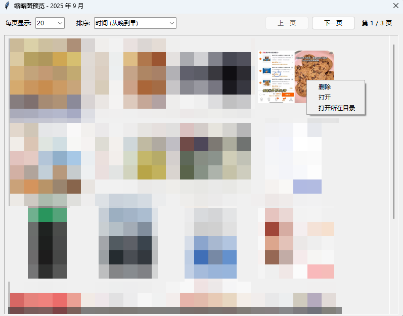

# QQ群聊图像清理器
一款拥有图形界面的**腾讯QQ桌面端**群聊图片的清理工具，用于彻底扫描和清理来自QQ群聊的海量被动存储的缓存图片（存放于路径`Documents\Tencent Files\<QQ号>\Image\Group2`），帮助您回收数GB的磁盘空间。


## ⚠️ 免责声明
> **数据无价，操作需谨慎！**

本程序旨在提供一套高效清理图片缓存的方案。

但是，文件删除是不可逆操作。

**请在完全理解本工具的功能后，再执行删除操作。**

**对于因使用本程序而导致的任何数据丢失或损坏，作者概不负责。**

**强烈建议在执行大规模删除前，备份重要数据。**


## 📚 背景介绍

您是否好奇过为什么C盘明明没安装软件却空间爆满？这可能是桌面端QQ与微信在作祟，他们默认会把聊天记录、图片、文件保存至“文档”目录下，而“文档”目录默认就在C盘，长期使用下来将占用大量磁盘空间。

令人气愤的是，桌面端QQ似乎过于敬业，以至于会将您所有群聊中的**所有图片、表情包、动图**（不管您是否看过）全部保存到本地。即使是您长年累月都不会点击查看的群聊，桌面端QQ都会默默记录所有图片、表情包、动图并保存，最终空间占用可能高达数十GB。

更令人气愤的是，QQ存储群聊图片既不是按照群聊分类存储，也不是按照日期分类存储，而是采用了一种**双层映射**的存储方式，导致用户想要手动清理这些图片时非常困难。


猜猜这一堆目录下，哪个目录里面有照片？


最令人气愤的是，桌面端QQ自带的清理工具根本无法有效清理这些群聊图片缓存，导致用户只能眼睁睁看着硬盘空间被无谓占用，手动清理、工具清理两条路都走不通。


QQ自带的扫描工具兼具扫描速度慢、扫描结果不全、删除文件失败等缺点于一身。本项目作者亲身体验为：使用QQ自带的清理工具扫描到44GB的硬盘占用，但是清理的时候“真戏假做”，只是提示我清理完成，但是重新扫描后依旧是44GB，压根没有成功清理。此外，QQ自带的清理工具每次扫描要很久（263140个文件，扫描了长达数个小时），反复扫描则更加折磨。


## 🎯 核心目标
本工具核心目标是解决QQ桌面端因长期使用而导致的群聊缓存图片过度占用磁盘空间的问题。

本工具克服了QQ自带的清理工具扫描速度慢、扫描结果不全、删除文件失败等问题，能够在短时间内（不超过一分钟）内完成扫描，同时扫描结果全面准确，能够有效删除图片文件并不影响双重映射结构的完整性。

本工具会扫描您指定的QQ群聊图片文件夹（支持输入QQ号自动定位，也支持手动选择文件夹，手动选择文件夹适用于修改过默认存储路径的QQ用户），允许您根据时间线批量地进行清理。


## 📖 主要功能
- 图形用户界面: 提供直观易用的操作界面，无需复杂的命令行操作。


- 路径自动定位: 支持输入QQ号自动定位QQ默认配置下存储群聊图片的文件夹路径。同时也支持手动选择文件夹，适用于修改过默认存储路径的QQ用户。


- 图片预览功能：双击年份可折叠/展开该年份下的月份，双击月份可折叠/展开该月份下的图片缩略图。右键缩略图可选择`删除`、`打开`、`打开所在目录`操作。



- 删除操作确认: 在确认删除前，会弹出一个窗口，随机展示部分待删除图片的缩略图，让您对要删除的内容有直观的了解，防止误删。


- 中英双语支持: 内置中文和英文两种语言，可随时切换。

- 高效扫描策略: 优化的文件扫描算法与实现，能够在短时间内完成对大量图片文件的扫描和分析。

- 精准时间分析: 综合图片文件的创建时间、修改时间、访问时间，取最早的一个作为文件的“真实时间”，分析更准确。

## 🧩 参考启发
> 参考与启发: [【科普向】QQ凭什么占据几十G空间？](https://www.bilibili.com/opus/786612832275791943)

这篇博客非常清晰地解释了QQ占用空间过大的核心原因在于QQ的“被动缓存”机制，但可惜并未提供有效的清理方法，进而催生了本项目。

为了让用户在翻阅聊天记录时能“秒开”图片，QQ会将您在任何聊天窗口（包括您并未点开查看的群聊、被屏蔽的群聊）中“看到”的所有图片，都自动下载并缓存到您的本地硬盘上。这种设计，高情商的说法是“预加载以提升体验”，但实际上是将本应由云服务器承担的存储成本，转嫁到了每一个用户的本地硬盘上。

日积月累，这些您可能永远不会再次查看的表情包、梗图、无关截图就会无声无息地塞满您的硬盘。更令人失望的是，QQ自带的清理功能往往收效甚微。它扫描出的可清理图片常常只有实际占用空间的冰山一角。用户缺少一个既安全、可控，又强大的清理工具。

本程序正是为了解决这一难题而生。 它提供了QQ官方所欠缺的精细化控制能力和操作透明度，让您能真正地掌控自己的硬盘空间，安全地移除那些“被动接收”的无用缓存。

在实施上，本项目克服了QQ Group2文件夹储存图片时采用两层映射导致的人工操作不便。如果不借助工具删除图片，很难做到筛选某个日期前的不重要图片进行删除，因为每张图片至少要点击两次文件夹才能看到缩略图。借助本项目工具，可以有效实现对图片按日期进行清理。

## 💻 如何使用

下载最新Release发行版并运行。目前展示支支持Windows端，下载最新exe文件即可。

## 🚀 如何自行部署
### ① 安装依赖:
本程序依赖 Pillow 库来生成图片缩略图。请通过pip安装：

```
pip install Pillow
# 或者使用requestments.txt安装
pip install -r requestments.txt
```

### ② 运行程序:
直接运行 qq_group_images_cleaner.py 文件:

```
python qq_group_images_cleaner.py
```

## 📦 依赖
Python 3.7+

Pillow

## 🤝 贡献
欢迎提交问题 (Issues) 和拉取请求 (Pull Requests)。

1. Fork 本仓库

2. 创建您的新分支 (git checkout -b feature/AmazingFeature)

3. 提交您的更改 (git commit -m 'Add some AmazingFeature')

4. 推送到分支 (git push origin feature/AmazingFeature)

5. 打开一个 Pull Request

## ⭐ Star History

[](https://star-history.com/#steven-jianhao-li/QQ-Group-Images-Cleaner&Date)